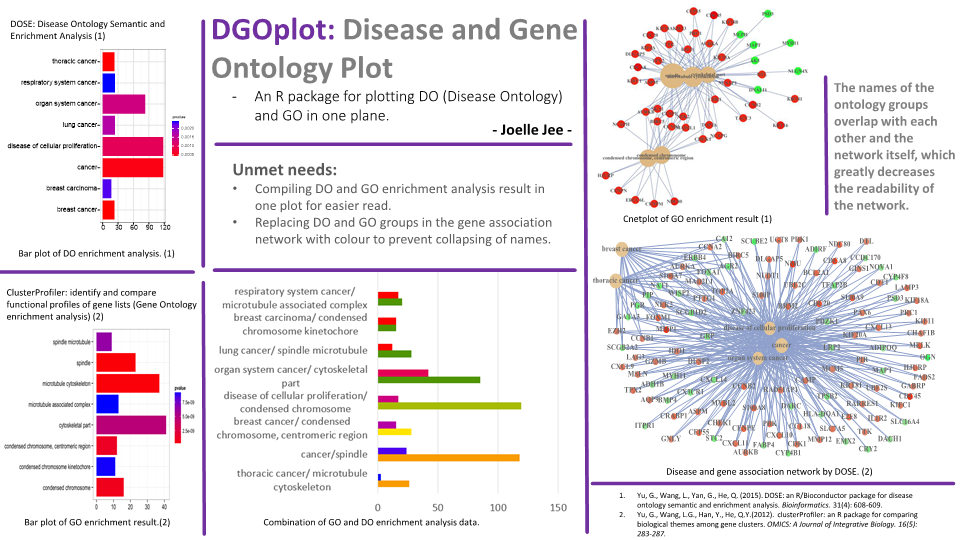
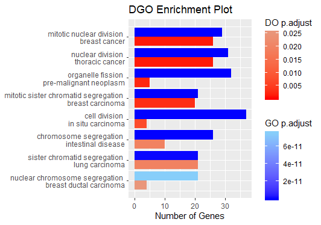
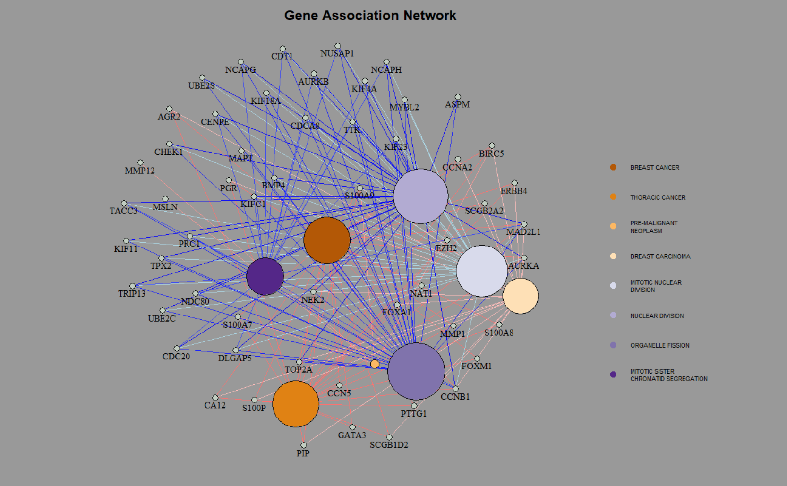

# DGOplot: Disease and Gene Ontology Enrichment Analysis and Plotting

<!-- badges: start -->
<!-- badges: end -->

The goal of DGOplot is to perform enrichment analses on Disease Ontology and Gene Ontology and plot the result into a bar plot and a gene association network. Currently limited to HUMAN DATA ONLY.



## Installation

You can install the latest version of DGOplot using:
``` r
require("devtools")
devtools::install_github("JoelleJee/DGOplot")
library("DGOplot")
```
## Overview

Plotting DO and GO enrichment analyses two ways:


\

\
The red and blue edges indicate DO and GO, respectively.

## Contributions

The author of the package is Yoonsun Jee. The functions available within this package include:

```r
library("DGOplot")
lsf.str("package:DGOplot")
# double bar plot to show DO and GO enrichment analyses results
# DGObarplot : function (DGOResult, showCategory = 8, DOcol = c("red", "darksalmon"), GOcol = c("blue", "lightskyblue"), pAdjustCutoff = 0.05)  

# draws a gene association network
# DGOnetplot : function (DGOResult, showCategory = 6, pAdjustCutoff = 0.05, cluster.strength = 10, GOcol = c("blue", "lightblue"), 
#     DOcol = c("red", "mistyrose"), termCol = "PuOr", geneCol = "honeydew3")  
# computes GO and DO enrichment anlyses
# enrichDGO : function (gene, Gont = "MF", Dont = "DO", pvalueCutoff = 0.05, pAdjustMethod = "BH", universe, qvalueCutoff = 0.2, 
#     minGSSize = 10, maxGSSize = 500, readable = FALSE, pool = FALSE)  

# shiny app GUI
# runDGOplot : function ()  
```
The enrichDGO function performs the DO and GO enrichment analyses using functions from 
DOSE and clusterProfiler R packages. The DOSE R package is used for DO enrichment analysis while the 
clusterProfiler R package is used for GO enrichment analysis.

The DGObarplot function takes in the result from enrichDGO function and plots it into a double bar graph
using ggplot2 R package.

The DGOnetPlot function uses the igraph R package and qgraph R package to graph a gene association network
from the enrichDGO results.

## Example

This a simple example using the dataset provided from DOSE R package.

``` r
library(DGOplot)
## basic example code
data(geneList)
gene <- names(geneList)[abs(geneList) > 2]
x <- enrichDGO(gene, universe = names(geneList))
DGObarplot(x, showCategory=5)
DGOnetplot(x, showCategory=5)

```

## Dependencies

Orgs.Hs.eg.db
* Human genome data

ggnewscale, ggplot2, igraph
* For bar plot and network plot

